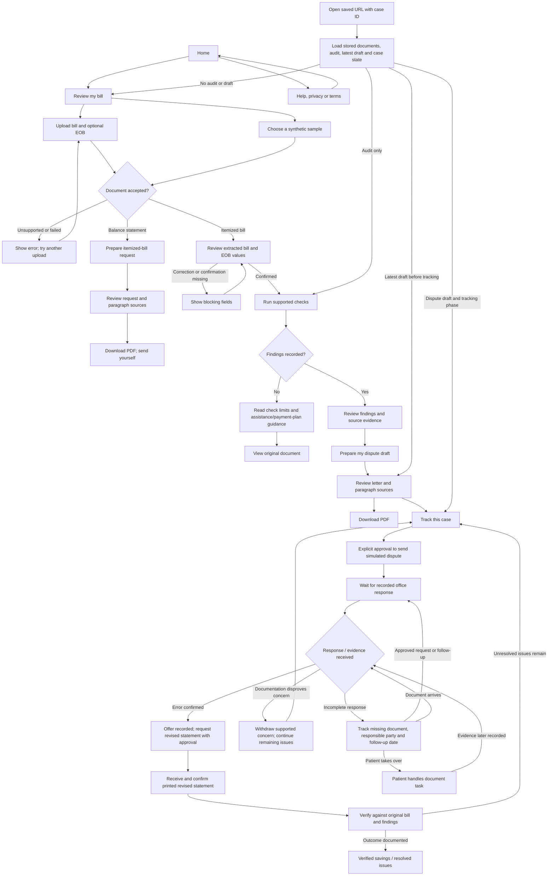
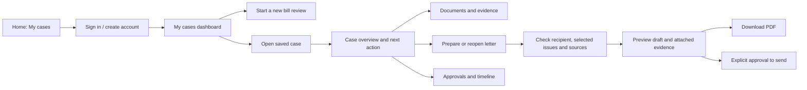

# BillLess user flows — current implementation

Based on `BillAuditApp.tsx`, `CaseScreen.tsx`, the case API and SPEC.md. Insurance-denial appeals are future MVP 5 work; the current letter is a billing dispute.

All review screens also offer Start over. Evidence and original documents can be opened where their controls are shown. Failed operations show errors; case polling retains the last loaded state and offers Retry. The latest upstream adds optional iMessage case linking and text approvals (A to approve, B to hold, WHY for evidence, STOP to disable), when its worker and credentials are configured. Web approvals remain available. Office responses currently enter through the separately labeled `/operator` simulator, not real correspondence.

## Access and persistence today

- There is no dashboard, sign-in, profile or case-list screen.
- A new case ID appears in the URL after ingestion. Bookmark `/review?case=CASE_ID` (legacy `/?case=CASE_ID` also works) to return to the saved state.
- Letter review has **Track this case**. The case screen displays its ID at the bottom.
- Cases are stored in Neon when DATABASE_URL is configured; the local fallback is memory and does not survive a server restart.
- The current prototype uses the case ID as its access key. Account ownership and authorization are not implemented.
- Resume is not a complete draft workspace: unsent local corrections and checkbox selections are not restored as an editable preparation session. A tracked case also lacks a visible route back to its existing letter.

## Recommended next design

Keep cases as separate records linked to an authenticated account, rather than putting all medical documents into a profile. The profile stores account settings; each case owns its documents, findings, drafts, deadlines, approvals and timeline. Account-aware authorization is required on case, document and action routes. Dashboard cards should show the case label, last update, status and one next-action button; avoid presenting questioned charges as achieved savings.

Letter preparation should first support reopening an existing draft from its case. Then add a clear preparation checklist: recipient, supported findings, requested documents, source evidence, preview and download/approval. Editing must preserve grounded facts and citations. Insurance-denial appeals need the MVP 5 denial criteria/evidence backend before they become an available user path.
